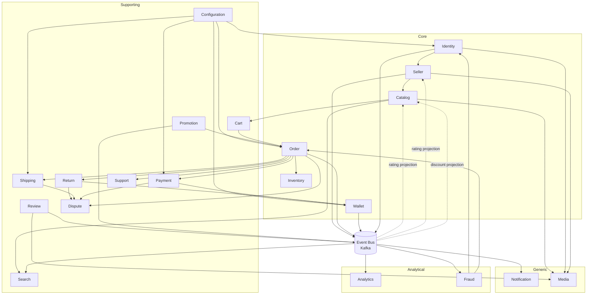

# Bounded Context Definition

> Organized following Domain-Driven Design (DDD) Strategic Design principles.
> Complements `functional.md` (WHAT the system does) by defining
> WHO owns which data and responsibilities.
>
> **Two-document principle:**
> - `functional.md` → answers "What does the system do?" (Product Owner, QA, Stakeholders)
> - `bounded-contexts.md` → answers "How is the system decomposed?" (Architects, Engineers)
>
> **Context Map Patterns** (Customer/Supplier, ACL, Open Host Service, etc.)
> are documented separately in `context-map.md`

---

## Context Ownership Rule

A bounded context is the single source of truth for the entities it owns.
Other contexts may keep local projections or read models derived from
domain events but must never directly write to another context's database.

Examples:
- Catalog owns Products
- Review owns Reviews (product and seller)
- Wallet owns Ledger
- Order owns Orders
- Seller owns Seller Rating Projection (derived from Review events)
- Catalog owns Product Rating Projection (derived from Review events)

Cross-context communication occurs through APIs, commands, or domain
events via Event Bus — never through direct database access across contexts.

> Full Event Catalog is documented separately in `domain-events.md`

---

## Context Classification

| Context | Type | Rationale |
|---------|------|-----------|
| Identity | Core | Foundation of all platform interactions |
| Seller | Core | Central to the marketplace business model |
| Catalog | Core | Products are the platform |
| Order | Core | The primary business transaction |
| Wallet | Core | Financial differentiation |
| Inventory | Core | Prevents overselling |
| Cart | Supporting | Serves Order creation |
| Return | Supporting | Serves Order lifecycle |
| Dispute | Supporting | Case management for escalations |
| Payment | Supporting | External integration layer |
| Shipping | Supporting | External integration layer |
| Review | Supporting | Enriches Catalog and Seller |
| Promotion | Supporting | Enriches Catalog and Order |
| Search | Supporting | Serves product discovery |
| Support | Supporting | Serves operational issues |
| Configuration | Supporting | Platform settings and regional rules |
| Analytics | Supporting | Serves business decisions |
| Fraud | Supporting | Protects Core domains |
| Notification | Generic | Commodity — use SendGrid/FCM/Twilio |
| Media | Generic | Commodity — use S3/Cloudinary |

---

## Core Domains

### 1. Identity Context
**Owns:** Users, Roles, Authentication, Authorization, Audit Logs, User Contacts, User Media references (avatars)
**Maps to:** User Service

### 2. Seller Context
**Owns:** Seller Profiles, Store Identity (slug, banner, logo), Team Members, Verification Documents, Vacation Mode
**Rating:** Seller Context owns `rating_sum` and `rating_count` as a **Projection** derived from Review events — Review Context remains the Source of Truth for individual reviews
**Maps to:** Seller Service
> Independent service — Seller management has grown into a full domain:
> verification pipeline, team members, store profile, vacation mode, store slug/SEO.

### 3. Catalog Context
**Owns:** Products, Categories, Attributes, Variants, Product Moderation, Product Visibility, Wishlist, Product Rating Projection (rating_sum + rating_count derived from Review events), Discount Projection (derived from Promotion events)
**Maps to:** Catalog Service
> **Wishlist is owned exclusively by Catalog** (customer-product interest relationship,
> not purchase intent). Wishlist has no knowledge of Cart, Checkout, or Payment.
> Wishlist items may be moved into Cart via Cart Service API.

### 4. Order Context
**Owns:** Checkout Orchestration, Orders, Order Items, Order Status History
**Maps to:** Order Service

### 5. Wallet Context
**Owns:** Seller Wallets, Ledger Transactions, Payout Methods, Payout Requests, Payout Transactions, Commission Settlement
**Maps to:** Wallet Service

### 6. Inventory Context
**Owns:** Stock Levels, Stock Reservations, Overselling Prevention
**Maps to:** Inventory Service

---

## Supporting Domains

### 7. Cart Context
**Owns:** Cart, Cart Items, Saved For Later
**Maps to:** Cart Service
> Does NOT own Wishlist — see Catalog Context.
> Cart lifecycle (days/weeks of browsing) is intentionally separate
> from Order lifecycle (minutes of checkout execution).

### 8. Return Context
**Owns:** Return Requests, Return Items, Return Evidence
**Maps to:** Return Service
> Routine self-service workflow.
> When parties disagree on outcome, escalation moves to Dispute Context.

### 9. Dispute Context
**Owns:** Disputes, Dispute Messages, Dispute Resolutions
**Maps to:** Dispute Service
> Distinct from Return: Return is a routine workflow;
> Dispute is an escalation when parties disagree.
> May originate from Return, Shipping, or Payment contexts.

### 10. Payment Context
**Owns:** Payment Transactions, Payment Provider Integration, Refund Initiation
**Maps to:** Payment Service
> Anti-Corruption Layer (ACL) wraps external gateways (PayTabs, iyzico, Stripe).
> See `context-map.md` for pattern specification.

### 11. Shipping Context
**Owns:** Shipping Providers, Shipments, Tracking Events, Shipping Zones, Shipping Rates
**Maps to:** Shipping Service
> Anti-Corruption Layer (ACL) wraps external providers (DHL, Aramex, local carriers).
> See `context-map.md` for pattern specification.

### 12. Review Context
**Owns:** Product Reviews, Seller Reviews, Review Votes, Review Media references
**Maps to:** Review Service
**Produces via Event Bus:**
- `review.submitted` → Catalog (product rating projection), Search (ranking)
- `seller.review.submitted` → Seller (seller rating projection), Search (ranking)

### 13. Promotion Context
**Owns:** Promotions, Promotion Rules, Coupons, Coupon Usage
**Maps to:** Promotion Service
**Produces via Event Bus:**
- `promotion.activated` → Catalog (discount projection), Search (ranking)
- `coupon.applied` → Order

### 14. Search Context
**Owns:** Search Indexes, Query Ranking, Filters, Search Suggestions, Autocomplete, Popular Searches
**Maps to:** Search Service (OpenSearch/Elasticsearch)
> Aggregates data from Catalog, Review, Promotion, and Seller via Event Bus.
> Read-only projection — never writes back to any source context.

### 15. Support Context
**Owns:** Tickets (Complaints `C-YYYY-NNNNNN` / Suggestions `S-YYYY-NNNNNN`), Ticket Messages, Ticket Attachments
**Maps to:** Support Service

### 16. Configuration Context
**Owns:** Platform Settings, Feature Flags, Country Settings (tax rules, supported currencies, payment providers per region)
**Maps to:** Configuration Service
> Promoted from Cross-Cutting Concern to full Context because it owns Domain Data.
> Consumed by all services needing regional rules or platform toggles.
> Admin Backoffice modifies settings via Configuration Service API only.

---

## Analytical Contexts
> Consume domain events via Event Bus. No original Source of Truth.
> Produce derived/internal events.

### 17. Analytics Context
**Owns:** KPIs, Aggregated Reports, Seller Performance Metrics, Dashboards
**Maps to:** Analytics Service
**Consumes via Event Bus:** Events from Order, Wallet, Review, Search, Promotion
**Produces:** `reports.generated`, `seller.metrics.updated`

### 18. Fraud/Risk Context
**Owns:** Risk Scores, Suspicious Activity Flags, Login Anomaly Records
**Maps to:** Fraud/Risk Service
**Consumes via Event Bus:** Events from Identity, Payment, Order, Wallet
**Produces:** `risk.score.updated`, `fraud.flag.created`
> Produced events consumed by:
> - Identity → account lockout
> - Order → delay/block suspicious orders

---

## Generic Domains

### 19. Notification Context
**Owns:** Notifications, Templates, Preferences, Delivery Queues (Email/SMS/Push)
**Maps to:** Notification Service
> All contexts publish events to Event Bus.
> Notification Service subscribes to relevant events and delivers to users.
> Delegate actual delivery to SendGrid (email), Firebase (push), Twilio (SMS).

### 20. Media Context
**Owns:** Files (file_key, mime_type, file_size, storage_provider, cdn_url)
**Maps to:** Media Service
> **Media owns files. Other contexts own metadata references only.**
> - Media Service: stores file_key, cdn_url
> - Catalog Service: stores product_image_id (reference to Media)
> - Review Service: stores review_media_id (reference to Media)
> Delegate storage to S3/Cloudinary.

---

## Cross-Cutting Concerns
> Not Bounded Contexts — applied across all contexts without owning domain data.

- **Localization** — language and currency formatting platform-wide
- **Audit Logging** — sensitive action tracking platform-wide
- **Observability** — logging, metrics, distributed tracing platform-wide

> Configuration and Feature Flags promoted to Configuration Context (§16)
> because they own Domain Data.

---

## Backoffice Application
> Not a Bounded Context. UI/orchestration layer (BFF) over existing Services.

**Admin Backoffice**
- Aggregates and controls: Identity, Catalog, Wallet, Promotion, Support, Analytics, Configuration via their APIs
- **Owns no domain entities** — pure orchestration/UI layer
- Admin users = regular Users with `role=admin` in Identity Context
- Platform settings managed via Configuration Service API

---

## Context Map

### Context Map Relationships

| From | To | Communication | Notes |
|------|----|---------------|-------|
| Identity | Seller | API (Command) | User must exist before becoming a seller |
| Seller | Catalog | API (Command) | Seller must be approved before listing products |
| Seller | Event Bus | Event | Seller events (approved, suspended) consumed by Search, Notification |
| Configuration | Identity, Order, Payment, Wallet, Shipping | API (Query) | Regional rules, feature flags, platform settings |
| Catalog | Search | Event (via Bus) | Product changes indexed for discovery |
| Catalog | Cart | API | Wishlist items moved to Cart on request |
| Review | Event Bus | Event | `review.submitted` → Catalog (rating), Seller (rating), Search (ranking) |
| Promotion | Event Bus | Event | `promotion.activated` → Catalog (discount), Search (ranking) |
| Promotion | Order | API (Command) | Coupon validation at checkout |
| Cart | Order | API (Command) | Checkout converts cart into order |
| Order | Inventory | API (Command) | Reserve and deduct stock |
| Order | Payment | API (Command) | Trigger payment processing |
| Payment | Wallet | Event (via Bus) | `payment.completed` → credit seller wallet |
| Order | Shipping | API (Command) | Trigger shipment creation |
| Order | Event Bus | Event | Order lifecycle events consumed by Review, Return, Notification, Analytics, Fraud |
| Return | Dispute | API (Command) | Rejected return escalates to dispute |
| Return | Wallet | Event (via Bus) | `return.approved` → refund transaction |
| Shipping | Dispute | API (Command) | Lost/damaged shipment escalates to dispute |
| Payment | Dispute | API (Command) | Payment issues escalate to dispute |
| Order | Support | API (Query) | Complaints reference orders |
| All Contexts | Event Bus | Event | Domain events published to Kafka |
| Event Bus | Notification | Event | All relevant events trigger notifications |
| Event Bus | Analytics | Event | Events feed aggregated reporting |
| Event Bus | Fraud | Event | Events feed risk detection |
| Fraud | Identity | API (Command) | Risk flags trigger account lock |
| Fraud | Order | API (Command) | Risk flags delay/block orders |
| Catalog, Review, Identity, Seller | Media | API (Command) | File upload/retrieval via Media Service |

> **Note:** Full Context Map Patterns (Customer/Supplier, ACL, Open Host Service,
> Published Language, Conformist) are documented in `context-map.md`

