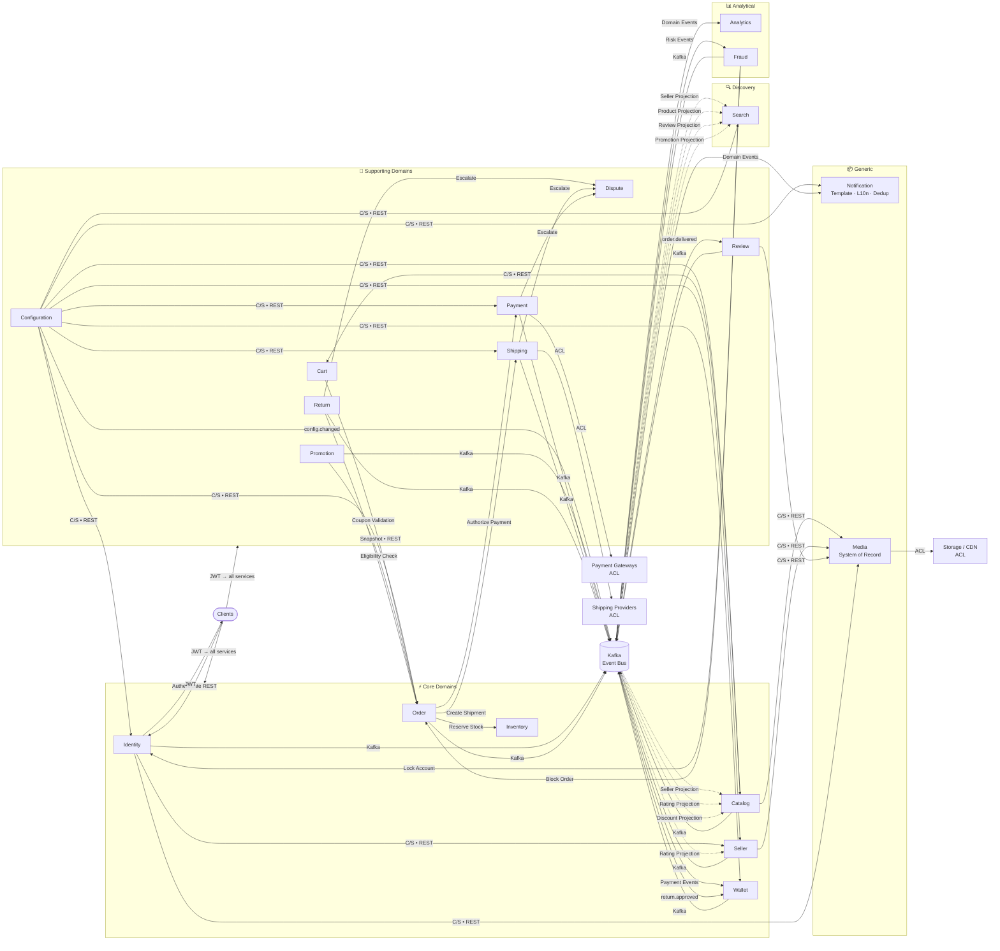

# Context Map

> Documents the formal relationships between Bounded Contexts using
> Domain-Driven Design (DDD) Context Mapping Patterns (Evans, Vernon).
>
> Complements:
> - `bounded-contexts.md` → WHO owns what
> - `domain-events.md` → Event contracts and schemas
> - `service-communication.md` → Runtime integration details

---

## Architectural Principles

- Each bounded context owns its own database — no cross-database queries
- **No service may invoke another service's private database, private tables,
  or internal repositories under any circumstances**
- Integration occurs through versioned APIs or domain events only
- Domain events are immutable — never updated after publication
- Projection consumers must tolerate duplicate and out-of-order events
  using idempotency and entity version (or event timestamp) checks —
  Kafka guarantees ordering only within a partition, not across topics
- Read models (Projections) are eventually consistent
- Search is eventually consistent by design — products may not appear
  in search results immediately after creation
- Analytics data is eventually consistent and unsuitable for transactional decisions
- Services remain independently deployable
- External systems are isolated through Anti-Corruption Layers (ACL)
- Synchronous communication (REST) is reserved for request/response workflows
- Asynchronous communication (Kafka) is preferred for state propagation
- Authorization decisions remain local to each service — Identity issues tokens only
- Clients authenticate with Identity once, receive a JWT, and present it
  directly to all services — services validate locally without calling Identity
- Media Service is the System of Record for binary assets; other contexts store
  immutable media identifiers only — media identifiers are globally unique
  and never reused, even after file deletion
- Files may only be replaced through Media Service versioning rules
- Payment is the single authority for payment state —
  Order stores only a projection of payment status
- Wallet is the single authority for financial ledger entries —
  no other context may calculate seller balances independently —
  Wallet never recalculates balances by querying Payment;
  balance changes occur exclusively through immutable ledger events —
  Wallet subscribes only to events that produce accounting entries:
  payment.captured, payment.refunded, payment.chargeback, return.approved
- Services cache configuration locally and invalidate cache
  upon `configuration.changed` events

---

## Pattern Legend

| Pattern | Abbreviation | Role |
|---------|-------------|------|
| Customer/Supplier | C/S | Domain model dependency — Downstream depends on Upstream model |
| Event Collaboration | EC | Contexts collaborate asynchronously through published events without sharing a domain model or requiring direct dependency (Vernon) |
| Anti-Corruption Layer | ACL | External system integration — translation layer protecting internal model |
| Open Host Service | OHS | Integration mechanism — stable, versioned, documented public API |
| Published Language | PL | Integration mechanism — versioned event/message contracts (Kafka JSON Schema) |
| Projection | PROJ | Consumer builds its own purpose-built read model from upstream events |
| Internal Translation | IT | Consumer transforms events for presentation (templates, localization) |
| Shared Kernel | SK | Not used — avoided in this Microservices architecture |

> **Diagram arrow conventions (Mermaid):**
> - `-->|C/S • REST|` = Customer/Supplier via REST (synchronous)
> - `-->|Kafka|` = Event Collaboration via Kafka (asynchronous, state change)
> - `-.->|Projection|` = Event Collaboration + Projection (async, read model)
> - `-->|ACL|` = External system via Anti-Corruption Layer

> **Important distinction (Evans):**
> - **Relationship Pattern** (C/S, EC) = organizational/model dependency between contexts
> - **Integration Mechanism** (OHS, PL, ACL, PROJ, IT) = how integration is technically realized

---

## Internal Context Relationships

### Identity → Seller
**Relationship:** Customer/Supplier
**Integration:** OHS (REST) + PL (Kafka)
```
Identity (Upstream/Supplier)
    ├── REST API: verify user existence
    └── Kafka → EventBus: user.role.changed, user.locked, user.deleted
Seller (Downstream/Customer)
```
> Authorization decisions remain local to each service.
> Identity issues JWT tokens with claims; services enforce their own rules.
> This prevents Identity from becoming a God Service.

---

### Identity → All Contexts (Authentication)
**Relationship:** Customer/Supplier (token authority)
**Integration:** OHS (JWT issuer) + PL (Kafka)
```
Clients → Identity REST API (authenticate)
Identity → issues JWT with roles and permission claims
Clients → present JWT to all services directly (no Identity call per request)
Identity → Kafka → EventBus: user.role.changed, user.locked, user.deleted
All Contexts → validate token locally; apply own authorization rules
```
> JWT tokens are self-contained — services validate locally without calling Identity.
> State changes propagate via Event Bus asynchronously.

---

### Seller → Catalog
**Relationship:** Customer/Supplier
**Integration:** PL (Kafka)
```
Seller (Upstream/Supplier)
    └── Kafka → EventBus: seller.approved, seller.suspended, seller.updated
Catalog (Downstream/Customer)
    └── blocks product listing until seller.approved received
```

---

### Configuration → All Contexts
**Relationship:** Customer/Supplier (settings authority)
**Integration:** OHS (REST) + PL (Kafka via EventBus)
```
Configuration (Upstream)
    ├── REST API: initial settings fetch on service startup or on-demand
    └── Kafka → EventBus: configuration.changed (cache invalidation trigger)
All Contexts (Downstream)
    └── cache configuration locally;
        subscribe to configuration.changed to invalidate and refresh cache
```
> Covers: tax rules per country, payment providers per region,
> feature flags per seller tier, search weights and ranking parameters,
> notification provider settings, coupon validity rules, SEO settings.

---

### Catalog → Search
**Relationship:** Event Collaboration
**Integration:** PL (Kafka) + PROJ
```
Catalog (Upstream — event publisher)
    └── Kafka → EventBus: product.created, product.updated, product.deleted
Search (Downstream — Projection)
    └── builds SearchDocument (≠ Product model):
        title, category, sellerRating, discount,
        normalizedKeywords, ngrams, phonetics, synonyms
```
> Search owns its own index schema independently of Catalog.
> No domain model dependency — Search depends only on the event contract.

---

### Review → Catalog (Rating Projection)
**Relationship:** Event Collaboration
**Integration:** PL (Kafka) + PROJ
```
Review (Upstream — event publisher)
    └── Kafka → EventBus: review.submitted, review.removed
Catalog (Downstream — Projection)
    └── updates local rating_sum + rating_count only
```
> No domain model dependency — Catalog builds independent projection.

---

### Review → Seller (Rating Projection)
**Relationship:** Event Collaboration
**Integration:** PL (Kafka) + PROJ
```
Review (Upstream — event publisher)
    └── Kafka → EventBus: seller.review.submitted, seller.review.removed
Seller (Downstream — Projection)
    └── updates local rating_sum + rating_count only
```

---

### Review → Search
**Relationship:** Event Collaboration
**Integration:** PL (Kafka) + PROJ
```
Review (Upstream — event publisher)
    └── Kafka → EventBus: review.submitted
Search (Downstream — Projection)
    └── enriches SearchDocument with rating data for ranking
```

---

### Promotion → Catalog (Discount Projection)
**Relationship:** Event Collaboration
**Integration:** PL (Kafka) + PROJ
```
Promotion (Upstream — event publisher)
    └── Kafka → EventBus: promotion.activated, promotion.deactivated
Catalog (Downstream — Projection)
    └── updates local discount projection for display
```

---

### Promotion → Search
**Relationship:** Event Collaboration
**Integration:** PL (Kafka) + PROJ
```
Promotion (Upstream — event publisher)
    └── Kafka → EventBus: promotion.activated
Search (Downstream — Projection)
    └── enriches SearchDocument with discount data for ranking
```

---

### Promotion → Order
**Relationship:** Customer/Supplier
**Integration:** OHS (REST)
```
Order (Downstream/Customer)
    └── REST API: validate and apply coupon at checkout
Promotion (Upstream/Supplier — OHS)
```

---

### Seller → Search
**Relationship:** Event Collaboration
**Integration:** PL (Kafka) + PROJ
```
Seller (Upstream — event publisher)
    └── Kafka → EventBus: seller.updated, seller.rating.updated
Search (Downstream — Projection)
    └── enriches SearchDocument with seller score for ranking
```

---

### Catalog → Cart
**Relationship:** Customer/Supplier
**Integration:** OHS (REST)
```
Catalog (Upstream/Supplier — OHS)
    └── REST API: product details, wishlist-to-cart transfer
Cart (Downstream/Customer)
```

---

### Cart → Order
**Relationship:** Customer/Supplier
**Integration:** OHS (REST — snapshot)
```
Cart (Supporting Domain — snapshot supplier)
    └── REST API: cart snapshot at checkout
Order (Core Domain — owns checkout model)
    └── builds Order from snapshot independently
```
> Order is NOT Conformist to Cart's structure.
> Reflects Order's position as Core Domain over Cart as Supporting Domain.

---

### Order → Inventory
**Relationship:** Customer/Supplier
**Integration:** OHS (REST — command)
```
Order (Downstream/Customer)
    └── REST API: reserve stock / deduct stock
Inventory (Upstream/Supplier — OHS)
```

---

### Order → Payment
**Relationship:** Customer/Supplier
**Integration:** OHS (REST — command)
```
Order (Downstream/Customer — orchestrator)
    └── REST API: initiate payment authorization
Payment (Upstream/Supplier — OHS)
```
> Order initiates payment and receives authorization confirmation only.
> Order does NOT wait for capture or settlement.
> Payment is the single authority for payment state —
> Order stores only a projection of payment status.
> Full lifecycle: Authorized → Captured → Settled (Wallet credited at Captured only)

---

### Payment → External Gateways
**Relationship:** ACL (external system)
**Integration:** ACL (per-provider adapter)
```
Payment Service (internal domain model)
    └── ACL adapters:
        ├── PayTabsAdapter  (UAE)
        ├── IyzicoAdapter   (Turkey)
        └── StripeAdapter   (UAE tech-classified)
External Gateways
```
> Raw provider responses stored in `raw_provider_response JSONB` for audit.

---

### Payment → Wallet
**Relationship:** Event Collaboration
**Integration:** PL (Kafka)
```
Payment (Upstream — event publisher)
    └── Kafka → EventBus:
        ├── payment.captured   → Wallet credits seller (net of commission)
        ├── payment.refunded   → Wallet debits refund amount
        └── payment.chargeback → Wallet debits disputed amount
```
> Wallet does NOT subscribe to payment.failed —
> a failed payment produces no accounting entry.
> Wallet is the single authority for financial ledger entries.

---

### Payment → Notification
**Relationship:** Event Collaboration
**Integration:** PL (Kafka) + IT
```
Payment (Upstream)
    └── Kafka → EventBus: payment.captured, payment.failed
Notification (Downstream — EC + IT)
    └── notifies customer of payment outcome
```

---

### Order → Shipping
**Relationship:** Customer/Supplier
**Integration:** OHS (REST — command)
```
Order (Downstream/Customer)
    └── REST API: create shipment after payment.captured
Shipping (Upstream/Supplier — OHS)
```

---

### Shipping → External Providers
**Relationship:** ACL (external system)
**Integration:** ACL (per-provider adapter)
```
Shipping Service (internal domain model)
    └── ACL adapters:
        ├── DHLAdapter
        ├── AramexAdapter
        └── LocalCarrierAdapter (Syria/regional)
```

---

### Order → Review
**Relationship:** Event Collaboration
**Integration:** PL (Kafka)
```
Order (Upstream — event publisher)
    └── Kafka → EventBus: order.delivered
Review (Downstream — event consumer)
    └── unlocks review eligibility
```

---

### Review Moderation (Seller → Admin → Review)
**Relationship:** Event Collaboration + Customer/Supplier
**Integration:** OHS (REST) + PL (Kafka)
```
Seller → REST → Review: report abusive review
Review → Kafka → EventBus: review.reported
Admin Backoffice → review.reported → decides (approve removal / dismiss)
Admin Backoffice → REST → Review: execute decision
Review → Kafka → EventBus: review.removed OR review.report.dismissed
Notification → notifies Seller of Admin decision
```
> Seller may REPORT a review — cannot hide or remove directly.
> Admin is the sole authority to remove reviews.

---

### Order → Return
**Relationship:** Customer/Supplier
**Integration:** OHS (REST)
```
Return (Downstream/Customer)
    └── REST API: validate order eligibility for return
Order (Upstream/Supplier — OHS)
```

---

### Return → Wallet
**Relationship:** Event Collaboration
**Integration:** PL (Kafka)
```
Return (Upstream)
    └── Kafka → EventBus: return.approved
Wallet (Downstream — event consumer)
    └── initiates refund transaction
```

---

### Return → Notification
**Relationship:** Event Collaboration
**Integration:** PL (Kafka) + IT
```
Return (Upstream)
    └── Kafka → EventBus: return.approved, return.rejected
Notification (Downstream — EC + IT)
```

---

### Return → Dispute
**Relationship:** Customer/Supplier
**Integration:** OHS (REST)
```
Return (Downstream/Customer)
    └── REST API: escalate rejected return
Dispute (Upstream/Supplier — OHS)
```

---

### Shipping → Dispute
**Relationship:** Customer/Supplier
**Integration:** OHS (REST)
```
Shipping (Downstream/Customer)
    └── REST API: escalate lost/damaged shipment
Dispute (Upstream/Supplier — OHS)
```

---

### Payment → Dispute
**Relationship:** Customer/Supplier
**Integration:** OHS (REST)
```
Payment (Downstream/Customer)
    └── REST API: escalate payment issue
Dispute (Upstream/Supplier — OHS)
```

---

### All Contexts → Notification
**Relationship:** Event Collaboration
**Integration:** PL (Kafka) + IT
```
All Contexts → Kafka → EventBus → Notification Service
    ├── consumes events via Published Language (no model dependency)
    ├── Internal Translation Layer:
    │   ├── Template Engine: event → notification template
    │   ├── Localization: AR / EN / TR per user preference
    │   └── Preference Engine: routes to email / push / SMS
    └── Deduplication Layer:
        └── idempotency key per event to prevent duplicate delivery
            (Kafka at-least-once delivery may replay events)
```

---

### All Contexts → Analytics
**Relationship:** Event Collaboration
**Integration:** PL (Kafka) + PROJ + Aggregation
```
All Contexts → Kafka → EventBus → Analytics Service
    ├── Projection: purpose-built read models per domain
    └── Aggregation: Materialized Views, KPIs, Monthly Reports
```
> Analytics data is eventually consistent and unsuitable for transactional decisions.
> Never reads production databases — purely event-sourced.

---

### All Contexts → Fraud
**Relationship:** Event Collaboration
**Integration:** PL (Kafka) + PROJ
```
Security- and commerce-relevant Contexts → Kafka → EventBus → Fraud Service
    └── Projection: risk models per entity
```
> Fraud subscribes only to security- and commerce-relevant events:
> user.login.failed, user.locked, payment.failed, payment.chargeback,
> order.placed, order.cancelled, return.requested, dispute.opened
> Fraud does NOT subscribe to operational events (SEO updates, template changes, etc.)

### Fraud → Identity / Order
**Relationship:** Customer/Supplier
**Integration:** OHS (REST) + PL (Kafka → Notification)
```
Fraud (risk authority)
    ├── REST → Identity: trigger account lock
    ├── REST → Order: block/delay suspicious order
    └── Kafka → EventBus: fraud.flag.created → Notification
```

---

### All Contexts → Media
**Relationship:** Customer/Supplier
**Integration:** OHS (REST)
```
Media Service (System of Record for binary assets — OHS)
    └── REST API: upload, retrieve, delete, version files
Catalog, Review, Identity, Seller
    └── store only immutable media identifiers (file_key / media_id)
```
> Media identifiers are globally unique and never reused, even after file deletion.
> CDN URLs are constructed at runtime from the identifier.

---

## External System Integration Summary

| External System | Integrated By | Pattern | Region |
|----------------|---------------|---------|--------|
| PayTabs | Payment Service | ACL | UAE |
| iyzico | Payment Service | ACL | Turkey |
| Stripe | Payment Service | ACL | UAE (tech-classified) |
| DHL | Shipping Service | ACL | UAE / Turkey |
| Aramex | Shipping Service | ACL | UAE / Turkey |
| Local Carriers | Shipping Service | ACL | Syria / regional |
| SendGrid | Notification Service | ACL | All regions (email) |
| Firebase (FCM) | Notification Service | ACL | All regions (push) |
| Twilio | Notification Service | ACL | All regions (SMS) |
| S3 / Compatible | Media Service | ACL | All regions (storage) |
| Cloudinary | Media Service | ACL | All regions (CDN) |
| OpenSearch | Search Service | ACL | All regions (search engine) |

---

## Pattern Usage Summary

| Pattern | Role | Applied To |
|---------|------|------------|
| Customer/Supplier | Domain model dependency | Identity→Seller, Seller→Catalog, Cart→Order, Order→Inventory/Payment/Shipping, Promotion→Order, Catalog→Cart, Return→Order/Dispute, Shipping→Dispute, Payment→Dispute, Fraud→Identity/Order |
| Event Collaboration | Async event-driven, no model dependency | Catalog/Review/Promotion/Seller→Search, Review→Catalog/Seller, Payment→Wallet/Notification, Order→Review, Return→Wallet/Notification, All→Analytics/Fraud/Notification |
| ACL | External system integration | All 12 external systems |
| OHS | Stable internal API mechanism | Identity, Configuration, Media, Promotion, Inventory, Payment, Shipping, Dispute, Catalog, Order |
| PL | Kafka event contract mechanism | All async communication |
| PROJ | Purpose-built read model | Search, Analytics, Fraud, Catalog (rating+discount), Seller (rating) |
| IT | Presentation transformation | Notification (templates + localization + deduplication) |
| SK | Not used | Avoided in Microservices |

---

## Context Map Diagram

> **Arrow conventions:**
> - `-->|C/S • REST|` = Customer/Supplier via REST (synchronous)
> - `-->|Kafka|` = Event Collaboration via Kafka (async, state change)
> - `-.->|Projection|` = Event Collaboration + Projection (async, read model update)
> - `-->|ACL|` = External system via Anti-Corruption Layer



