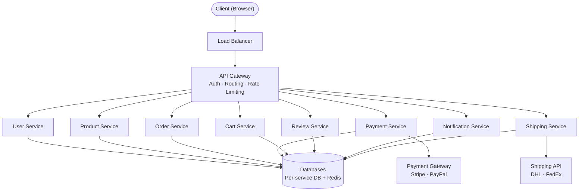

# High-Level Architecture

## Request Flow
1. Client sends HTTP request
2. DNS resolves domain to Load Balancer
3. Load Balancer distributes to available servers
4. API Gateway authenticates and authorizes the request
5. Request routed to the appropriate Microservice
6. Service processes and returns JSON response

## Core Components
- **Load Balancer** — Distributes traffic, eliminates SPOF
- **API Gateway** — Auth, routing, rate limiting
- **Microservices** — Independent, horizontally scalable services

## Services
- User Service
- Product Service
- Order Service
- Payment Service
- Cart Service
- Review Service
- Notification Service
- Shipping Service

## Architecture Diagram

## External Systems
- **Payment Gateway** — Stripe, PayPal
- **Shipping API** — DHL, FedEx
