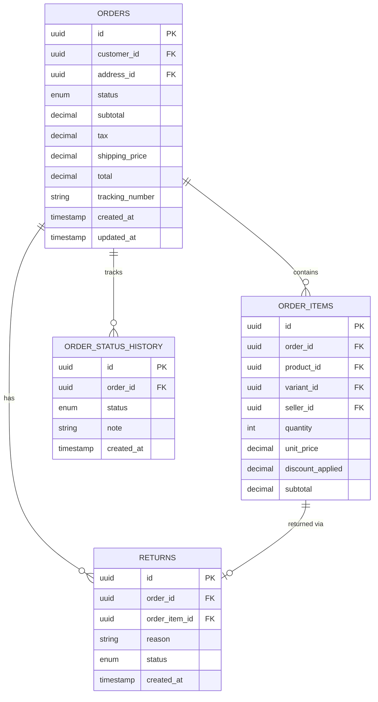

# Order Service — Database Schema

## Order Status Values
| Status | Description |
|--------|-------------|
| `pending` | Awaiting payment confirmation |
| `payment_failed` | Payment was declined |
| `confirmed` | Payment successful, seller notified |
| `processing` | Seller is preparing the order |
| `shipped` | Handed to shipping provider |
| `in_transit` | On the way to customer |
| `delivered` | Successfully received |
| `return_requested` | Customer requested a return |
| `returned` | Return completed |
| `cancelled` | Order cancelled |

## Notes
- `ORDER_STATUS_HISTORY` tracks every status change with timestamp
- `unit_price` in ORDER_ITEMS uses Snapshot Pattern
- `tracking_number` populated when status = shipped

