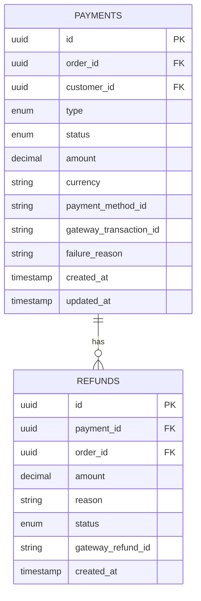

# Payment Service — Database Schema

## Payment Type Values
| Type | Description |
|------|-------------|
| `payment` | Customer payment |
| `refund` | Refund to customer |

## Payment Status Values
| Status | Description |
|--------|-------------|
| `pending` | Awaiting gateway response |
| `success` | Payment completed |
| `failed` | Payment declined |
| `refunded` | Amount returned to customer |

## Notes
- `payment_method_id` is Stripe token — card data never stored here (PCI DSS)
- `gateway_transaction_id` is the reference from Stripe/PayPal
-`failure_reason` populated only when status = failed

