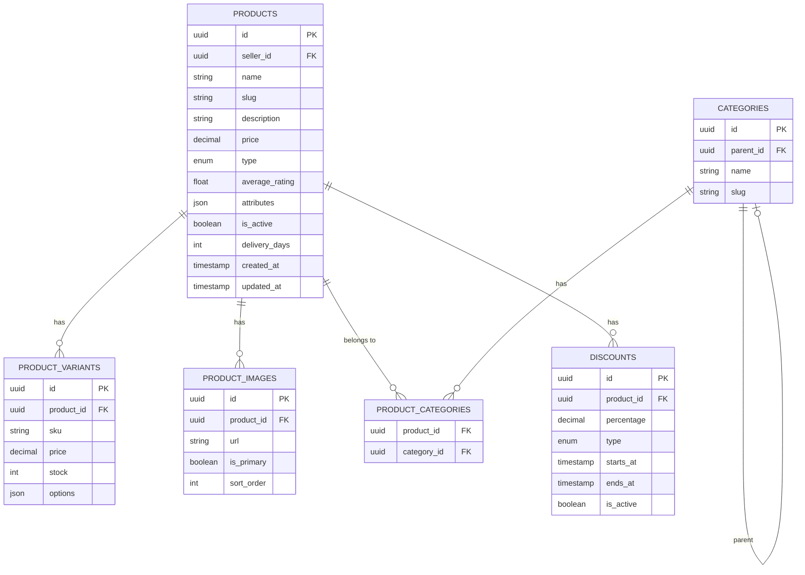

# Product Service — Database Schema

## Product Type Values
| Type | Description |
|------|-------------|
| `physical` | Regular product with weight and dimensions |
| `food` | Perishable with prep time and temperature |
| `digital` | Downloadable, no shipping required |

## Discount Type Values
| Type | Description |
|------|-------------|
| `daily` | Daily deal |
| `seasonal` | Seasonal sale |
| `occasion` | Special occasion (e.g. Black Friday) |
| `seller` | Seller-defined discount |

## Notes
- `attributes` (JSONB) stores type-specific fields
- `PRODUCT_VARIANTS.options` stores variant details e.g. {"size": "M", "color": "red"}
- `CATEGORIES.parent_id` enables nested categories (e.g. Electronics > Phones > Android)

