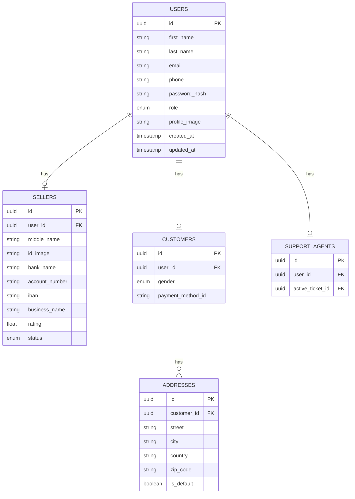

# User Service — Database Schema

## Seller Status Values

|      Status        |      Description                                               |
|----------------|-------------------------------------------------|
| `pending`       |   Registered, awaiting admin approval       |
| `active`           |   Approval and operational                          |
| `suspended`  |   Frozen by admin due to policy violation  |
| `inactive`       |   Deactivated by seller                                   |

